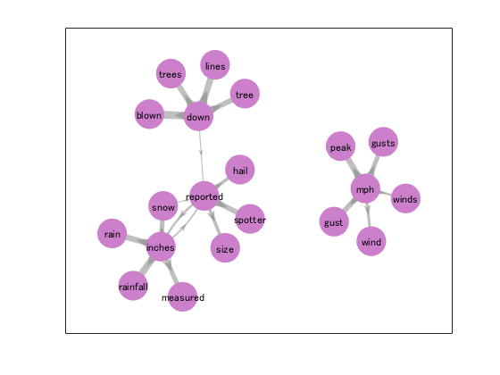
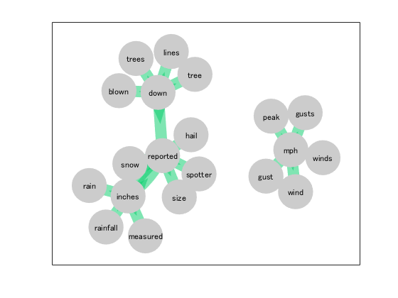
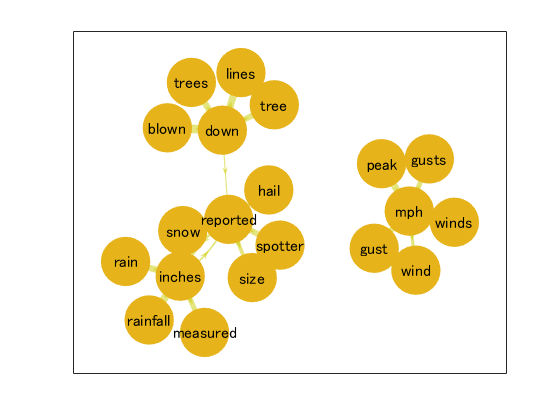

# Co-occurrence analysis with Text Analysis Toolbox


One of the most common applications of text analytics is performing co-occurrence analysis. Here is an example of performing the analysis with MATLAB. **Note: Text Analytics Toolbox is required to run the codes in this example.**


# Functions for Co-occurrence analysis


The following three functions are provided.


   -  createCOTable.m 
   -  createCONetwork.m 
   -  visualizeCO.m 

## createCOTable.m


This function creates a co-occurence table for given keywords. It finds top N most frequently occurring words (co-occurrence words) and their frequency within given span for given keywords. It also calculates T-value and MI-value for each co-occcurence words.


## createCONetwork.m


This function creates a Co-occurrence network from the co-occurence table created by createCOTable.m. 


## visualizeCO.m


This function is to visualize the co-occurence network created by createCONetwork.m


For detaile of these functions, refer to each M-file, or use doc/help function.


# Example


Let's see how it works. We use the sample data 'weatherReports.csv', which is provided with Text Analytics Toolbox R2019b.  (As an alternative sample file, 'FactoryReports.csv' can be used for R2020a. Un-comment line 2 and 7.) 


## Preparation


First, import the sample data file into a table. 


```matlab
fileName = 'WeatherReports.csv'; % For MATLAB R2019b 
% fileName = 'FactoryReports.csv'; % For MATLAB R2020a

data = readtable(fileName,'TextType','string');
head(data) 
```
| |Time|event_id|state|event_type|damage_property|damage_crops|begin_lat|begin_lon|end_lat|end_lon|event_narrative|storm_duration|begin_day|end_day|year|end_timestamp|
|:--:|:--:|:--:|:--:|:--:|:--:|:--:|:--:|:--:|:--:|:--:|:--:|:--:|:--:|:--:|:--:|:--:|
|1|"22-Jul-2016 16:10:00"|644330|"MISSISSIPPI"|"Thunderstorm Wind"|""|"0.00K"|34.1398|-88.6298|34.1220|-88.6260|"Large tree down between Plantersville and Nettleton."|00:05:00|22|22|2016|"22-Jul-16 16:15:00"|
|2|"15-Jul-2016 17:15:00"|651823|"SOUTH CAROLINA"|"Heavy Rain"|"2.00K"|"0.00K"|34.9400|-81.0300|34.9400|-81.0300|"One to two feet of deep standing water developed on a street on the Winthrop University campus after more than an inch of rain fell in less than an hour. One vehicle was stalled in the water."|00:00:00|15|15|2016|"15-Jul-16 17:15:00"|
|3|"15-Jul-2016 17:25:00"|651825|"SOUTH CAROLINA"|"Thunderstorm Wind"|"0.00K"|"0.00K"|35.0100|-80.9300|35.0100|-80.9300|"NWS Columbia relayed a report of trees blown down along Tom Hall St."|00:00:00|15|15|2016|"15-Jul-16 17:25:00"|
|4|"16-Jul-2016 12:46:00"|651828|"NORTH CAROLINA"|"Thunderstorm Wind"|"0.00K"|"0.00K"|35.6400|-82.1400|35.6400|-82.1400|"Media reported two trees blown down along I-40 in the Old Fort area."|00:00:00|16|16|2016|"16-Jul-16 12:46:00"|
|5|"15-Jul-2016 14:28:00"|643319|"MISSOURI"|"Hail"|""|""|36.4500|-89.9700|36.4500|-89.9700|""|00:07:00|15|15|2016|"15-Jul-16 14:35:00"|
|6|"15-Jul-2016 16:31:00"|643321|"ARKANSAS"|"Thunderstorm Wind"|""|"0.00K"|35.8500|-90.1000|35.8376|-90.0865|"A few tree limbs greater than 6 inches down on HWY 18 in Roseland."|00:09:00|15|15|2016|"15-Jul-16 16:40:00"|
|7|"15-Jul-2016 16:03:00"|643431|"TENNESSEE"|"Thunderstorm Wind"|"20.00K"|"0.00K"|35.0563|-89.9367|35.0498|-89.9037|"Awning blown off a building on Lamar Avenue. Multiple trees down near the intersection of Winchester and Perkins."|00:07:00|15|15|2016|"15-Jul-16 16:10:00"|
|8|"15-Jul-2016 17:27:00"|643437|"TENNESSEE"|"Hail"|""|""|35.3845|-89.7800|35.3845|-89.7800|"Quarter size hail near Rosemark."|00:05:00|15|15|2016|"15-Jul-16 17:32:00"|


Then, extract the text data from the column "event_narrative", and perform* *tokenizeation and other pre-processing (removing punctuation, etc...)


```matlab
textData = data.event_narrative; % For MATLAB R2019b
% textData = data.Description; % For MATLAB R2020a

docs = tokenizedDocument(textData);
docs = addPartOfSpeechDetails(docs);
docs = erasePunctuation(docs);
docs = removeStopWords(docs);
docs = removeShortWords(docs,2);
docs = removeLongWords(docs,15);
docs = removeEmptyDocuments(docs);
docs = addLemmaDetails(docs);
```
## Creating co-occurence table


Now, we're ready to do co-occurence analysis. First, we need to define some parameters.  


The first one is the number of keywords, for which the co-occuring words are sought.  Here, we selected top four most occurring words in the data as keywords.  (The function also allows users to define the keywords as a cell array of words.)


```matlab
nKeywords = 4;
```


The next parameter is the span, which is the length of the window in which the co-occuring words are sought.


```matlab
span = 4;
```


The parameter "nCooc" defines the number of co-occuring words sought for each keywords.


```matlab
nCooc = 5;
```


The last one, 'mode',* *defines the location of the keywords within the span. 


```matlab
mode = 'center';
```


Then, we create the co-occurrence table.


```matlab
COTable   = createCOTable(docs,span, nKeywords, nCooc, mode)
```
| |Word|Counts|COWord|COCount|COCountAll|T|MI|
|:--:|:--:|:--:|:--:|:--:|:--:|:--:|:--:|
|1|"reported"|9640|"inches"|635|7755|-9.0278|10.7677|
|2|"reported"|9640|"hail"|380|3312|-6.9837|11.2544|
|3|"reported"|9640|"size"|222|1917|-5.3379|11.2678|
|4|"reported"|9640|"snow"|217|4344|-5.2774|10.0548|
|5|"reported"|9640|"spotter"|180|903|-4.8065|12.0513|
|6|"inches"|7755|"snow"|731|4344|-2.5054|11.8069|
|7|"inches"|7755|"reported"|652|9640|-2.3661|10.4919|
|8|"inches"|7755|"measured"|542|3288|-2.1573|11.7772|
|9|"inches"|7755|"rain"|469|2032|-2.0068|12.2628|
|10|"inches"|7755|"rainfall"|371|1135|-1.7848|12.7648|
|11|"down"|6450|"blown"|1324|3111|3.3188|13.1455|
|12|"down"|6450|"trees"|1045|4770|2.9484|12.1875|
|13|"down"|6450|"tree"|789|4007|2.5620|12.0336|
|14|"down"|6450|"reported"|549|9640|2.1371|10.2439|


The columns of the table represent the following.


   -  Word: keyword for which co-occurring words are sought 
   -  Counts: occurence of the keyword in the entire document 
   -  COWord: co-occuring word within the span of the keyword 
   -  COCount: occurrence of the COWord within the span of the keyword 
   -  COCountAll: occurence of the COWord in the entire data 
   -  T : T-value 
   -  MI: MI-value 

## Create and visualize co-occurence network


Once we create the co-occurence table, it is straightforward to create co-occurence network and associated diagram.


```matlab
CONetwork = createCONetwork(COTable,'MI');

visualizeCO(CONetwork,'NodeColor',[0.8 0.5 0.8],'FontSize',9,'MarkerSize',24);
```




You can also specify the edge color and edge width


```matlab
visualizeCO(CONetwork,'EdgeColor',[0 0.8 0.4],'EdgeWidth',12);
```




Another example.


```matlab
visualizeCO(CONetwork,'NodeColor',[0.9 0.7 0.1],'FontSize',12,'MarkerSize',36,'EdgeColor',[0.8 0.8 0]);
```




This README.md file is generated with livescript2markdown by minoue-xx
https://github.com/minoue-xx/livescript2markdown


\begin{flushright}
*Copyright 2020 The MathWorks, Inc.*
\end{flushright}

